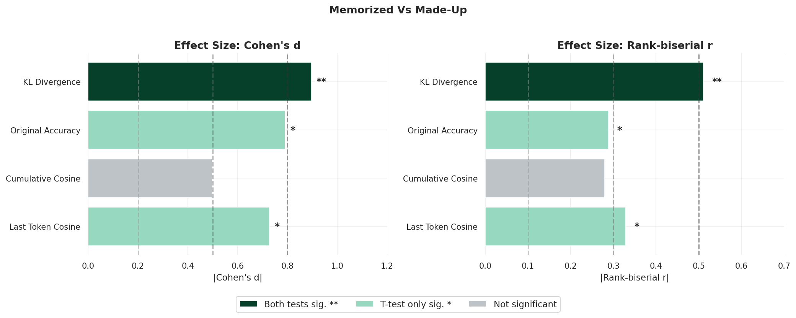
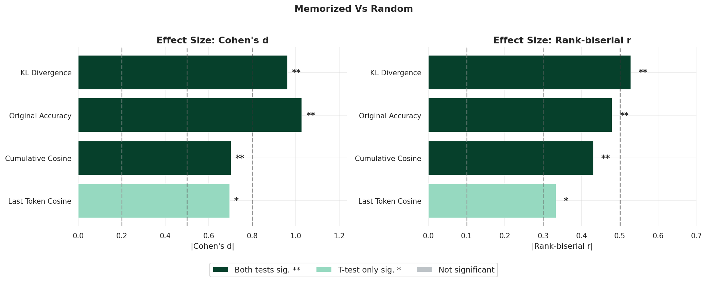
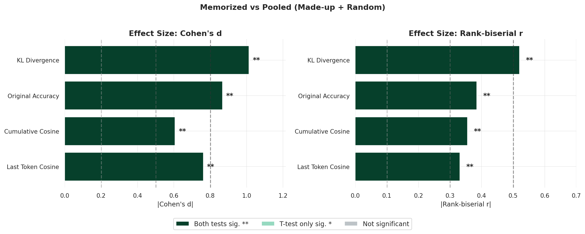

# Error Hypothesis Analysis Summary

---

## Token Complexity Analysis

**Metrics analyzed:**
- Zipf frequency (word frequency on logarithmic scale)
- Token length (number of characters)

**Result:** No significant differences in token complexity between memorized and other conditions, indicating that differences in token difficulty are not confounding the observed effects.

---

## Metrics Analyzed

The following metrics were computed to measure accuracy between base and replacement model outputs:

| Metric | Description |
|--------|-------------|
| Last Token Cosine | Cosine similarity of logits at final position |
| Cumulative Cosine | Average cosine similarity across all positions |
| Original Accuracy | Fraction of positions where argmax predictions match |
| KL Divergence | KL divergence between base and replacement distributions at final position |

---

## Statistical Testing

**Tests used:**
- **T-test** (parametric): Assumes normally distributed data
- **Mann-Whitney U test** (non-parametric): Does not assume normal distributions

**Test direction:** One-tailed tests testing whether memorized condition performs worse than other conditions.

**Effect size measures:**
- **Cohen's d**: small (<0.5), medium (0.5-0.8), large (>0.8)
- **Rank-biserial r**: negligible (<0.1), small (0.1-0.3), medium (0.3-0.5), large (>0.5)

---

## Pairwise Comparisons

### Memorized vs Made-up

| Metric | t-test Sig. | Mann-Whitney Sig. | Cohen's d | Rank-biserial r |
|--------|-------------|-------------------|-----------|-----------------|
| Last Token Cosine | Yes | No | medium | medium |
| Cumulative Cosine | No | No | medium | small |
| Original Accuracy | Yes | No | medium | small |
| KL Divergence | Yes | Yes | large | large |

### Memorized vs Random

| Metric | t-test Sig. | Mann-Whitney Sig. | Cohen's d | Rank-biserial r |
|--------|-------------|-------------------|-----------|-----------------|
| Last Token Cosine | Yes | No | medium | medium |
| Cumulative Cosine | Yes | Yes | medium | medium |
| Original Accuracy | Yes | Yes | very large | medium |
| KL Divergence | Yes | Yes | large | large |

## Pooled Comparison

Compares memorized (n=15) against all other conditions combined (n=30), providing increased statistical power.

### Memorized vs Pooled (Made-up + Random)

| Metric | t-test Sig. | Mann-Whitney Sig. | Cohen's d | Rank-biserial r |
|--------|-------------|-------------------|-----------|-----------------|
| Last Token Cosine | Yes | Yes | medium | medium |
| Cumulative Cosine | Yes | Yes | medium | medium |
| Original Accuracy | Yes | Yes | large | medium |
| KL Divergence | Yes | Yes | very large | large |

---

## Results

- **KL Divergence** shows the strongest and most consistent effect, with large effect sizes and significance on both tests across all comparisons.

- **Original Accuracy** shows very large effect sizes in the pooled comparison and against random, with significance on both tests.

- **Cumulative Cosine** and **Last Token Cosine** show medium effect sizes; the pooled comparison achieves significance on both tests due to increased statistical power.

